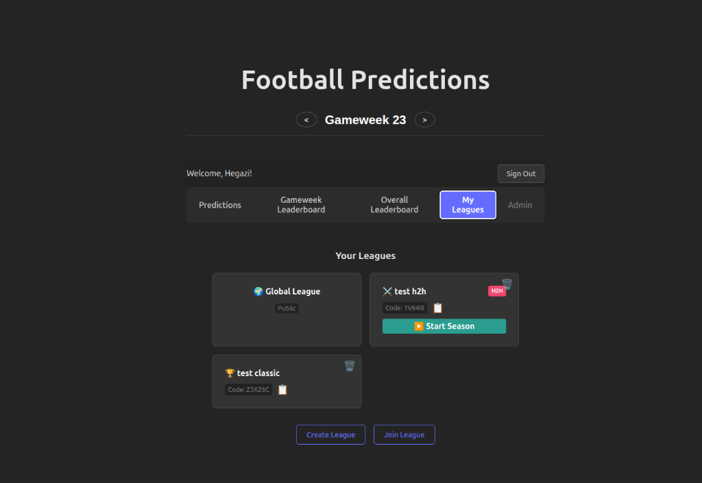
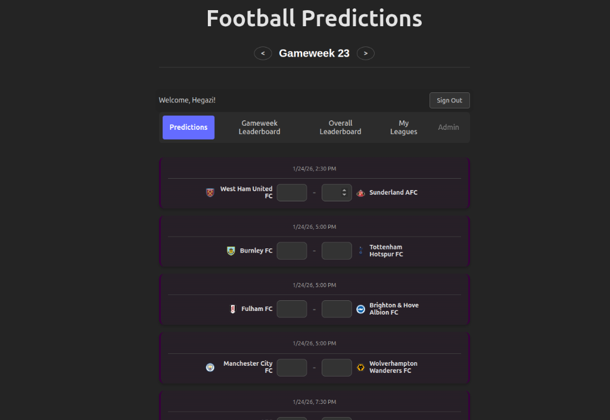

# ⚽ Football Predictions App

A modern, real-time football prediction platform where you can compete with friends in **Classic Leagues** (Points) or **Head-to-Head Battles**.

Built with **React**, **Vite**, and **Firebase**.



## ✨ Features

### ⚔️ Game Modes
*   **Classic League**: Rank by total accumulation of points throughout the season.
*   **Head-to-Head**: Weekly 1v1 matchups against other players in your league. Including:
    *   **Round Robin Scheduling**: Automatically generates a fair season schedule for all players.
    *   **Ghost Bot**: Automatically handles odd numbers of players by adding an "Average Bot" to the league.
    *   **Live Matchups**: See who your opponent is directly on your dashboard.

### 📊 Predictions & Leaderboards
*   **Live Scores**: Real-time updates during matches.
*   **Auto-Save**: Predictions save automatically as you type.
*   **Gameweek Leaderboard**: See who won the week with detailed score breakdowns.
*   **Overall Leaderboard**: Track the season-long race for the title.



### 🔒 Secure & Private
*   **Google Auth**: Seamless sign-in.
*   **Private Leagues**: Create leagues with a 6-character code to share with friends.
*   **Admin Tools**: League admins can manage members and start H2H seasons.

## 🚀 Getting Started

### Prerequisites
*   Node.js (v14+)
*   npm

### Installation

1.  Clone the repository:
    ```bash
    git clone https://github.com/your-username/football-predictions.git
    cd football-predictions
    ```

2.  Install dependencies:
    ```bash
    npm install
    ```

3.  Set up Firebase:
    *   Create a project in [Firebase Console](https://console.firebase.google.com/).
    *   Enable **Authentication** (Google Provider).
    *   Enable **Firestore Database**.
    *   Create a `.env` file with your config (see `.env.example`).

4.  Run the development server:
    ```bash
    npm run dev
    ```

## 🛠️ Tech Stack
*   **Frontend**: React, Vite
*   **Data**: Firebase Firestore (Real-time NoSQL)
*   **Auth**: Firebase Auth
*   **Styling**: Modern CSS3 (Dark Theme, Glassmorphism)

---
*Created by Hegazi*
